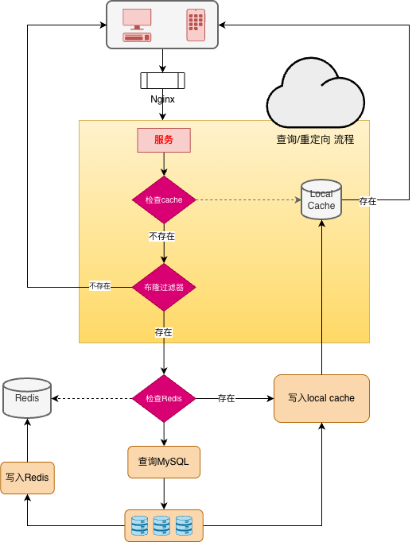

# 短链接项目
> 本短链接项目旨在将长 URL 转换为简洁的短链接，方便用户分享和使用。通过该项目，用户可以提交长 URL，系统会生成对应的唯一短链接，访问短链接时会自动重定向到原始的长 URL。

## 功能特性
* 短链接生成：用户可以输入长 URL，系统会生成对应的短链接。
* 唯一标识：每个长 URL 会生成唯一的短链接，确保不会重复。
* 重定向功能：访问短链接时，系统会自动重定向到原始的长 URL。
* 认证与授权：部分功能可能需要用户进行认证和授权，确保数据安全。

## 缓存策略

1. **本地缓存**：优先查询应用本地缓存，减少网络开销。
2. **布隆过滤器**：通过布隆过滤器判断短链接是否存在，避免无效数据库查询。
3. **Redis 缓存**：查询 Redis 缓存，快速获取热点数据。
4. **数据库查询**：布隆过滤器确认存在后，查询 MySQL 数据库获取原始长 URL，并同步更新 Redis 和本地缓存。

## 说明
* 实际运行时各个微服务不暴露给用户，只留一个网关接口（port：8080）
* todo：设计更加强大的网关

## 启动步骤
> 修改各个微服务的配置文件
* docker-compose up
* go run gateway.go
* go run auth.go
* go run convert.go
* go run redict.go

## 技术栈
Go-Zero
MySQL
Redis
jwt
Kafka
bloom过滤
...

